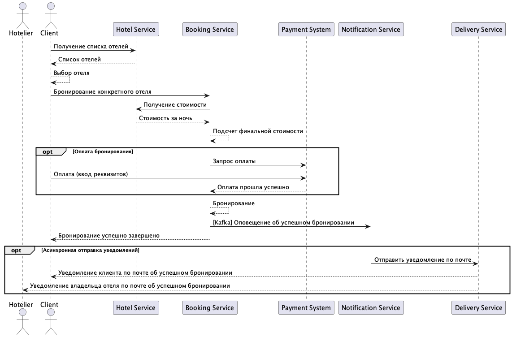
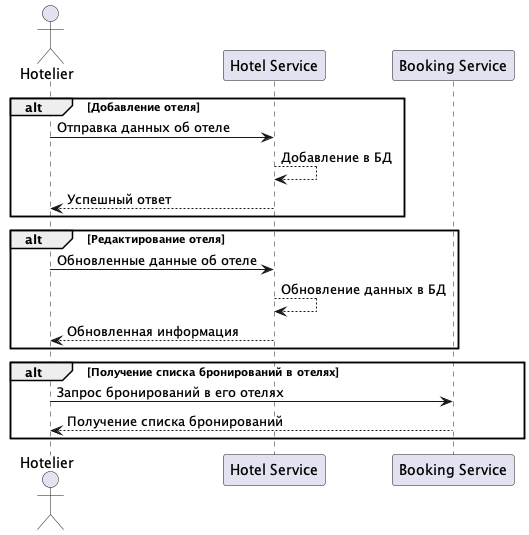
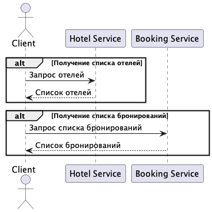

# Итоговый проект 2024
## Задача 

Разработать систему бронирования номеров. Разработать контракты, схемы для хранения данных, написать миграции и заполнить базы данных тестовыми данными.
### Обеспечение наблюдаемости работы сервисов: 
- сервисы должны писать структурированный логи в stdout,stderr
- метрики пишутся в prometheus 
- обеспечение возможности сквозной трассировки (обрабатывать данные трассировки в заголовках запросов/сообщениях kafka, писать данные о трассировке в jaeger). 
### Обеспечение возможности развертывания сервисов и их зависимостей в docker с использованием docker compose. 
- баз данных
- kafka
- jaeger
- prometheus
- grafana (опционально)
### Разработанны тесты 
Покрыть сервисы unit и интеграционными тестами. 
### Архитектура (детали): 
- используется подход чистая архитектура
- используется стандарт https://github.com/golang-standards/project-layout
- все настраиваемые параметры передаются через env, создан файл .env.dev с настройками для работы сервисов в окружении для разработки. 
Интеграция с реальной системой доставки нотификации (push, telegram) 

Реализована системa управления доступом (с использованием готовых решений напр. keycloak) или собственного сервиса. Есть API для аутентификации. Операции в системе проходят авторизацию.
Ограничения: 
1) Отельер не может видеть брони чужих отелей и изменять информацию о чужих отелях
2) Клиент не может видеть чужие брони и создавать брони для других пользователей
3) Отельер не может создавать брони

## Техническое описание
### Клиенты системы
1. Client (Клиент):
   - Пользователь, который бронирует отель через систему.
   - Взаимодействует с системой через REST API.
2. Hotelier (Отельер):
   - Администратор или владелец отеля, который управляет информацией об отеле и взаимодействует с системой бронирования.
   - Также использует REST API для взаимодействия.

### Основные микросервисы
1. Booking Svc (Сервис бронирования):
   - Основной сервис, управляющий процессом бронирования.
   - Отвечает за создание бронирований.
   - Взаимодействует с базой данных Booking Data для хранения информации о бронированиях.
   - Отправляет события в Queue (Kafka) для последующей обработки в Notification Svc.
2. Hotel Svc (Сервис отеля):
   - Управляет информацией об отелях, включая данные о номерах и ценах.
   - Отвечает за добавление и обновление отелей.
   - Хранит данные в базе Hotels Data.
   - Предоставляет информацию Booking Svc для обработки запросов на бронирование.
3. Notification Svc (Сервис уведомлений):
   - Отвечает за отправку уведомлений клиентам и отельерам о статусе бронирования.
   - Получает события из очереди Queue (Kafka) и отправляет уведомления через Delivery System.
4. Delivery System
   - Отвечает за доставку нотификаций клиентам.
   - Позволяет отправлять уведомления через различные каналы (email, SMS и т.д.).
   - Внешний сервис, не разрабатывается студентами. Можно произвести интеграцию с любой системой рассылки для получения дополнительных баллов.
5. Payment System (Система оплаты):
   - Отвечает за обработку платежей.
   - Интегрирована с Booking Svc для проведения транзакций по бронированию отелей.
   - Внешний сервис, не разрабатывается студентами. Можно сделать собственный сервис с имитацией оплаты для получения дополнительных баллов.
   - Предоставляет API для создания заявки на оплату, возвращает результат через webhook.

### Базы данных:
1. Database (PostgreSQL) для Booking Data:
   - Хранит информацию о всех бронированиях.
   - Предоставляет данные Booking Svc для управления бронированиями.
2. Database (PostgreSQL) для Hotels Data:
   - Хранит информацию о всех отелях, доступных в системе.
   - Используется Hotel Svc для предоставления актуальной информации номерах.
   
### Взаимодействие между компонентами:
   - REST API: используется для обеспечения взаимодействия пользователей с системой.
   - Kafka (Queue): Booking Svc отправляет события в Kafka, чтобы Notification Svc мог обработать их и отправить соответствующие уведомления.
   - GRPC: используется для синхронного межсервисного взаимодействия.

### Сценарии работы сервиса
#### Основной сценарий

#### Сценарии владельца отеля

#### Сценарии клиента

